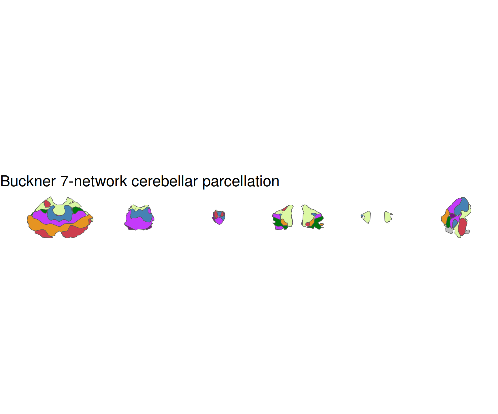
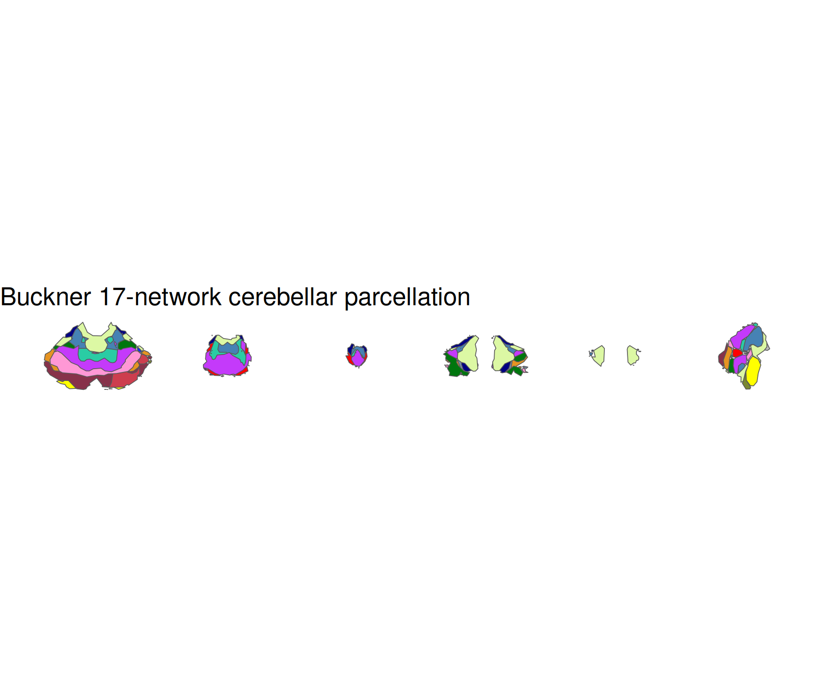

<!-- README.md is generated from README.qmd. Please edit that file -->

# ggsegBuckner

> **Work in Progress** – This package is under active development and
> has not yet been officially released.

Buckner cerebellar functional parcellation for the ggseg ecosystem.

## Installation

We recommend installing the ggseg-atlases through the ggseg
[r-universe](https://ggseg.r-universe.dev/ui#builds):

``` r
options(repos = c(
  ggseg = "https://ggseg.r-universe.dev",
  CRAN = "https://cloud.r-project.org"
))

install.packages("ggsegBuckner")
```

You can install this package from [GitHub](https://github.com/) with:

``` r
# install.packages("pak")
pak::pak("ggseg/ggsegBuckner")
```

## 7-network parcellation

``` r
library(ggseg)
library(ggsegBuckner)
library(ggplot2)

ggplot() +
  geom_brain(
    atlas = buckner7(),
    mapping = aes(fill = label),
    position = position_brain(. ~ view),
    show.legend = FALSE
  ) +
  scale_fill_manual(values = buckner7()$palette, na.value = "grey") +
  theme_void() +
  ggtitle("Buckner 7-network cerebellar parcellation")
```



## 17-network parcellation

``` r
ggplot() +
  geom_brain(
    atlas = buckner17(),
    mapping = aes(fill = label),
    position = position_brain(. ~ view),
    show.legend = FALSE
  ) +
  scale_fill_manual(values = buckner17()$palette, na.value = "grey") +
  theme_void() +
  ggtitle("Buckner 17-network cerebellar parcellation")
```



## Reference

Buckner RL et al. (2011). The organization of the human cerebellum
estimated by intrinsic functional connectivity. *Journal of
Neurophysiology*, 106(5), 2322-2345.

## Code of Conduct

Please note that the ggsegBuckner project is released with a
[Contributor Code of Conduct](CODE_OF_CONDUCT.md). By contributing to
this project, you agree to abide by its terms.
